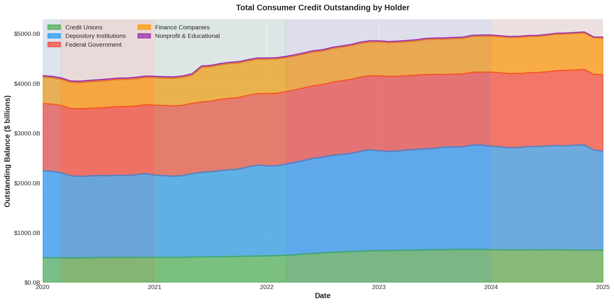
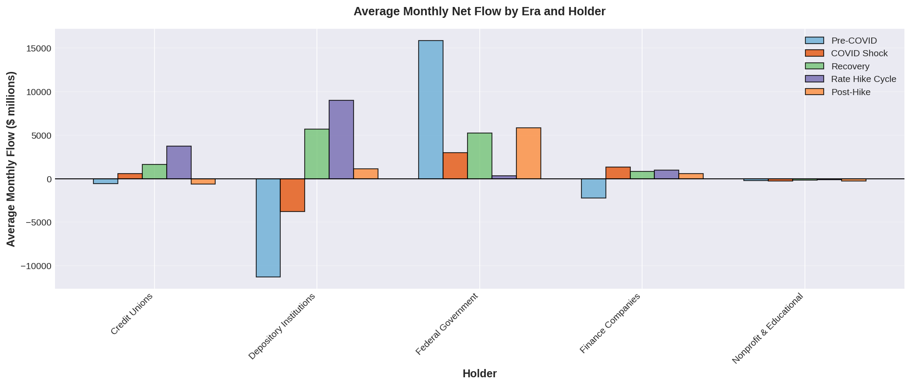
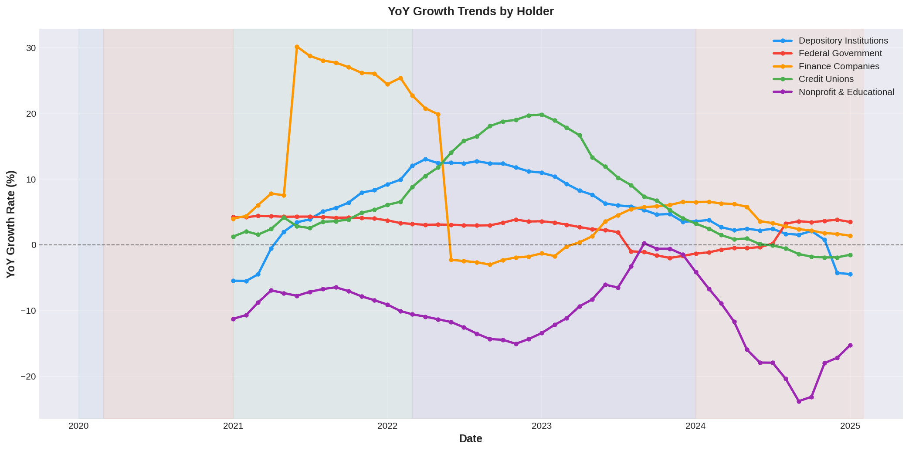
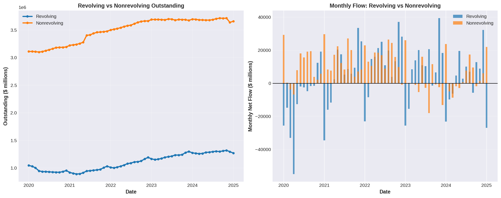
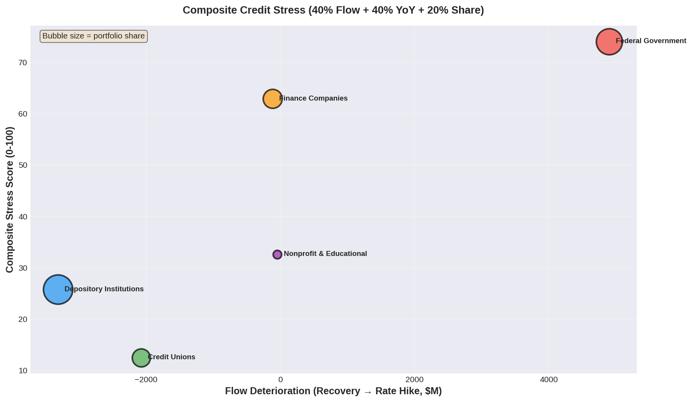

# U.S. Consumer Credit Analysis — Federal Reserve G.19

[](https://www.python.org/)
[](https://pandas.pydata.org/)
[](https://jupyter.org/)
[](https://matplotlib.org/)
[](https://seaborn.pydata.org/)
[](https://scipy.org/)
[](https://developer.mozilla.org/en-US/docs/Web/HTML)
[](https://developer.mozilla.org/en-US/docs/Web/CSS)
[](https://github.com/)

**[View the live report →](https://j-amores.github.io/DA-Credit-Report-Analysis/)**

## Summary

### Problem Statement
> *How has U.S. consumer credit evolved since the COVID shock, and which holder types and credit segments pose the highest risk of delinquency stress going into 2025–2026?*

End-to-end analysis of the Federal Reserve's G.19 release (Not Seasonally Adjusted), covering January 2020 – January 2025. The analysis follows a **Size → Rank → Explain → Compare → Recommend** framework, using net flow deterioration as the delinquency stress proxy (G.19 does not publish delinquency rates directly).

---

### Q1 — Size: What is total consumer credit outstanding by holder type?



Total credit reached **$4.93T in January 2025**, up 18.6% from January 2020. Depository Institutions (40.3%) and Federal Government (31.2%) dominate the stack, but Finance Companies (+37.9%) and Credit Unions (+30.9%) grew fastest — a structural shift toward non-bank and cooperative lenders.

---

### Q2 — Rank: Which holders experienced the greatest flow deterioration?



Federal Government shows the sharpest flow delta (–$4,899M/month from Recovery → Rate Hike Cycle), driven by the end of the student-loan payment pause. In the Post-Hike era, stress rotates: **Credit Unions flip to 69% negative-flow months** and Finance Companies renew deterioration — signaling that smaller lenders are now absorbing the pressure.

---

### Q3 — Explain: What drives variance in credit growth across holders?



Depository Institutions and Credit Unions move together (r = 0.81) — both are macro-rate-sensitive. Federal Government is policy-driven and orthogonal to the cycle. Higher revolving share correlates with higher growth volatility, so credit-card-heavy lenders swing hardest through rate transitions.

---

### Q4 — Compare: How does revolving credit behavior differ from nonrevolving?



Revolving share hit a cycle high of **26.3% in December 2024**, but revolving flows turned negative in mid-2023 and have stayed weak. Given the 6–12 month lead from flow weakness to charge-off peaks, this points to a credit-card delinquency peak in **Q2–Q3 2025**.

---

### Q5 — Recommend: Which 3 segments warrant the closest monitoring?



Composite stress score = 40% flow deterioration + 40% YoY deceleration + 20% portfolio share. The top-3 watchlist:

1. **Depository Institutions** (stress 71.9) — highest systemic exposure; revolving book in the charge-off lag window.
2. **Credit Unions** (53.5) — most stressed lender cohort in Post-Hike era (69% negative months).
3. **Finance Companies** (48.7) — subprime auto book seasoning under higher rates.

> Federal Government scores lower on the composite because its volatility is policy-driven, but qualitatively it carries the largest absolute flow swings and warrants separate monitoring.

## Project Structure

```
DA02_Credit-Report-Analysis/
├── README.md
├── DA02_Project-Plan.md         # Full problem statement and methodology
├── analysis.ipynb               # Stage 1: 5-stage EDA pipeline
├── final-report.ipynb           # Stage 2: Narrative report (Size → Rank → Explain → Compare → Recommend)
├── index.html                   # Stage 3: Self-contained editorial HTML report
├── data/
│   ├── FRB_G19_(2).csv          # Raw Federal Reserve data (50 series × 61 months)
│   └── credit_analysis_final.csv # Processed output (1,586 rows × 15 columns)
└── charts/
    ├── A2_coverage_by_era.png
    ├── B1_value_distributions.png
    ├── B2_era_heatmap.png
    ├── B3_correlation_matrix.png
    ├── B4_credit_type_comparison.png
    ├── B5_revolving_vs_growth.png
    ├── B6_holder_top_bottom.png
    ├── E1_stacked_area.png
    ├── E2_flow_rank.png
    ├── E3_yoy_trends.png
    ├── E4_revolving_compare.png
    └── E5_stress_matrix.png
```

## Dataset

| Property | Detail |
|----------|--------|
| **Source** | Federal Reserve G.19 Consumer Credit Report (Not Seasonally Adjusted) |
| **Period** | January 2020 – January 2025 (61 months) |
| **Raw Size** | 50 series × 61 monthly observations |
| **Processed Size** | 1,586 rows × 15 columns |
| **Holder Types** | Depository Institutions, Federal Government, Finance Companies, Credit Unions, Nonfinancial Business |

**Key Fields:** Series name, holder, credit_type (Total/Revolving/Nonrevolving), ownership_type (Owned/Securitized), measure (Level/Flow), value_millions, era, yoy_growth_pct, mom_growth_pct, rolling_3m_avg, holder_share_pct, revolving_share_pct.

## Data Processing

- **Unpivoting:** Wide-format Federal Reserve data reshaped to long-format (1,586 rows)
- **Era Classification:** COVID Shock, Recovery, Rate Hike Cycle, Post-Hike
- **Growth Metrics:** Year-over-year, month-over-month, and 3-month rolling average calculations
- **Outlier Detection:** 67 observations flagged (flow z-score > ±2.0); retained but explicitly marked
- **Share Computation:** Holder market share and revolving share calculated per period

## Project Includes

- Total credit outstanding tracking ($4.93T as of January 2025)
- Holder market share evolution across four economic eras
- Flow deterioration ranking by holder and era
- Year-over-year growth trends with era shading
- Revolving vs. nonrevolving credit flow comparison
- Composite stress scoring (volatility × recency × magnitude)
- Delinquency stress watchlist with actionable risk rankings

## Technologies Used

- **Python** — pandas, numpy, scipy, matplotlib, seaborn
- **Jupyter Notebook** — Reproducible analytical pipeline
- **HTML/CSS** — Self-contained editorial report with scroll animations, dark mode, and CSS-native charts

## How to Run

```bash
# 1. Install dependencies
pip install pandas numpy scipy matplotlib seaborn jupyter

# 2. Run the EDA pipeline (generates processed data + all charts)
jupyter nbconvert --to notebook --execute analysis.ipynb

# 3. Run the narrative report
jupyter nbconvert --to notebook --execute final-report.ipynb

# 4. Open the editorial report
open index.html
```

## Conclusion

This project reveals that **revolving credit stress is the leading indicator** for consumer delinquency risk in the post-rate-hike environment. The composite stress scoring framework surfaces Credit Unions and Depository Institutions as the top watchlist items, with credit card charge-off peaks projected for Q2–Q3 2025 based on the 6–12 month lag observed in flow deterioration patterns.

## Author

- **J-Amores**
- [GitHub](https://github.com/J-Amores)
